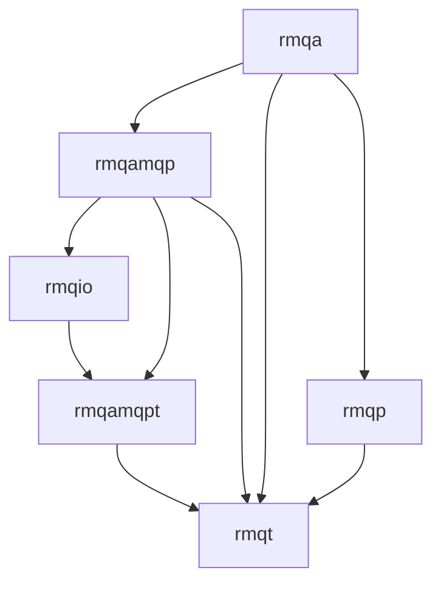

# Library Guide

This guide summarizes the libraries under `src/rmq/`, links to deeper write‑ups in each package, and calls out how the stack runs inside a Boost.Asio `io_context` (including io_uring capable builds) so it can share a single threaded event loop with other async work. For low-latency/high-throughput guidance (single-threaded, allocations, locks, compression), see [`docs/advanced-usage.md`](./advanced-usage.md).

- [`rmqp`](../src/rmq/rmqp/README.md) — public API surface (connections, producers, consumers).
- [`rmqa`](../src/rmq/rmqa/README.md) — concrete implementations and lifecycle glue for the public API, including watchdog and retry logic.
- [`rmqt`](../src/rmq/rmqt/README.md) — shared data types (topology, endpoints, messages, credentials, confirms/acks).
- [`rmqamqp`](../src/rmq/rmqamqp/README.md) — AMQP channel/state machines that translate high-level actions into protocol frames.
- [`rmqamqpt`](../src/rmq/rmqamqpt/README.md) — low‑level AMQP 0‑9‑1 method/field/frames.
- [`rmqio`](../src/rmq/rmqio/README.md) — I/O and event loop abstractions; default Asio implementation exposes `io_context` for integration with other event sources (epoll, inotify, sockets, timerfd, io_uring). Uses [`Boost.Asio`](https://github.com/boostorg/asio) ([docs](https://www.boost.org/doc/libs/latest/doc/html/boost_asio.html)). Event loop is owned by `RabbitContext` by default; provide a custom `rmqio::EventLoop` if you need to drive an existing `io_context`.
- [`rmqtestmocks`](../src/rmqtestmocks/README.md) — gmock doubles for the public API. See also [`docs/rmqtestmocks.md`](./rmqtestmocks.md).
- [`rmqtestutil`](../src/tests/rmqtestutil/README.md) — shared test utilities (mock timers/resolvers/channels).

## Event Loop and io_context Sharing
- `rmqio::AsioEventLoop` owns the `boost::asio::io_context` and is the default loop injected into `rmqa::RabbitContextImpl`. The loop is single-threaded by default, making it safe to co-locate other [`Boost.Asio`](https://www.boost.org/doc/libs/latest/doc/html/boost_asio.html) reactors (epoll/kqueue/IOCP/io_uring backends) in the same thread.
- The loop exposes `context()` so you can register additional handlers (e.g., `boost::asio::posix::stream_descriptor` for inotify/eventfd, or `io_uring`-backed executors when compiled with Asio's io_uring support) and post them alongside RabbitMQ traffic.
- `rmqio::AsioConnection`, `Resolver`, and `TimerFactory` all run on that shared `io_context`, letting RabbitMQ I/O share timing and DNS with other socket/TCP/UDP work.
- For remote REST/gRPC/TCP clients, create your own Asio sockets/services against the same `io_context`; `RabbitContext` will keep the context alive via a work guard until shutdown.

## Entry Points
- Application entry: construct `rmqa::RabbitContext` (via `rmqp::RabbitContext` interface), create `rmqa::VHost` connections, then producers/consumers/topology.
- Event loop integration: pass a custom `rmqio::EventLoop` (e.g., `AsioEventLoop` configured with io_uring) via `RabbitContextOptions` if you need to own the `io_context` lifecycle elsewhere.
- Testing: use [`rmqtestmocks`](../src/rmqtestmocks/README.md) and [`rmqtestutil`](../src/tests/rmqtestutil/README.md) for gmock-based doubles and utilities; see [`docs/rmqtestmocks.md`](./rmqtestmocks.md) and [`docs/tests.md`](./tests.md).
- Tools: monitor example uses [`Boost.Beast`](https://www.boost.org/doc/libs/latest/libs/beast/doc/html/index.html) for management HTTP polling and [`Quill`](https://github.com/odygrd/quill) for logging.
