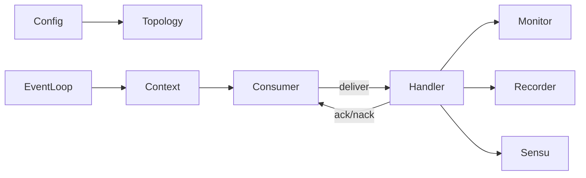

# Order Status Monitor: rmqcpp Migration Notes

Repository analyzed: `tastyworks/order-status-monitor` (submodule `order-execution`).

## What the project does
- Long-running service that listens on RabbitMQ queues/exchanges for order status events and emits alerts when orders are slow/stuck. Entry point: `main.cpp`, core logic: `OrderStatusMonitor`/`OrderEvent`.
- Config via env vars (`MQ_HOST/PORT/USERNAME/PASSWORD/VHOST/EXCHANGE/DIRECT_EXCHANGE/QUEUE`, site bindings, order timeout). Binds to topic/direct exchanges; processes messages via a `MessageHandler` and responder (Sensu/log/cout).

## Current RabbitMQ stack
- Depends on `order-execution` submodule’s `twLib/mq` layer (`MQAdapter`, `MQChannelWrapper`, `MessageHandler`).
- `MQAdapter` is built on `SimpleAmqpClient` (rabbitmq-c) with a `USE_AMQP_TW_PATCH` toggle; owns its own channel/connection threads and blocking loop.
- No shared `io_context`/Asio; no explicit TLS support or modern epoll/io_uring integration. Routing keys are bound via helper methods, payload handling is raw strings.

## Migration strategy to rmqcpp
- Use `rmqio::AsioEventLoop` as the single event loop (epoll readiness by default; io_uring available when built with Asio support). Keep all AMQP I/O on that loop.
- Replace `MQAdapter` with `rmqa::RabbitContext` + `rmqa::VHost` + `rmqa::Consumer`:
  - Build `rmqt::Endpoint` from env vars (`MQ_HOST`, `MQ_PORT`, `MQ_VHOST`, credentials), optionally `rmqt::SecureEndpoint` if TLS is needed.
  - Declare or passively use exchanges/queues via `rmqt::Topology`; bind routing keys from env (including direct exchange bindings).
  - Create a consumer with explicit ack and prefetch tuned for workload; hook `OrderStatusMonitor` as the delivery handler.
  - If any publishing/acknowledgement flows are needed, use `rmqa::Producer` with confirms enabled (default).
- Reuse responders unchanged; only the message ingestion layer swaps to rmqcpp.
- Config plumbing: map env vars to `rmqt::Endpoint`/`SecurityParameters`; support overrides for timeouts/prefetch if useful.
- Threading model: single-threaded `io_context` (or limited pool if necessary) to simplify ordering/latency; rmqcpp reconnect and topology redeclare can be enabled to mirror current behavior.

## Issues/gaps in current implementation (opportunities when migrating)
- `MQAdapter` owns its own threads and blocking loop; harder to integrate with other async work and to control shutdown deterministically.
- No explicit TLS path; adding TLS today would require more patching to SimpleAmqpClient.
- Limited visibility into confirms/returns; mandatory/confirm handling not apparent, so unroutable messages may be dropped silently.
- Env parsing is minimal (no validation/whitespace trimming), and bindings are inferred from all env vars with certain prefixes.
- Error handling relies on throwing/exit; backoff/reconnect behavior is opaque in the wrapper.

## Suggestions for improvement with rmqcpp
- Centralize event loop on `rmqio::AsioEventLoop`; choose epoll or io_uring when available to reduce syscalls.
- Make topology explicit: declare exchanges/queues with durability/arguments matching broker config; validate bindings at startup and fail fast with clear logs.
- Expose prefetch/ack mode/timeouts as config; ensure every delivery is acked/nacked, and hook returns/dead-letter flows where needed.
- Add TLS configuration via `rmqt::SecurityParameters` (CA/client certs, verification mode) for production.
- Add structured logging around reconnects, declares, and consumer state; surface metrics/hooks for stuck order detection.
- Keep responders, monitor logic, and env schema; only swap the MQ layer to rmqcpp and adopt a clean shutdown using the shared `io_context`.

## Proposed modern C++23/26 refactor (rmqcpp-first)

**Event loop and threading**
- Use a single `rmqio::AsioEventLoop` (epoll readiness by default) for all AMQP and Sensu UDP I/O. Add a build preset to enable io_uring when available. Run single-threaded for predictable latency; avoid extra strands/executors.

**Topology and consumers**
- Build explicit topology from config (env/CLI/TOML): exchanges, queues, binds (topic + direct), durability/arguments. Fail fast on errors.
- One `rmqa::Consumer` on the main queue with explicit acks and configurable prefetch. Handler runs on the same thread and always ack/nacks.
- If publishing is needed, create one `rmqa::Producer` with mandatory+confirms; log returns.

**Low-allocation handler**
- Define a `ConsumerHandler` concept/invocable taking `(DeliveryInfo, std::span<const std::byte>) -> AckDecision`, using `std::string_view`/`std::span` and `pmr` allocators to minimize copies.
- Parse payloads via views; only materialize data as needed. Use `std::expected` for setup/errors where practical.

**JSON: Glaze instead of nlohmann**
- Replace nlohmann/json with Glaze for decode/encode of order payloads. Define `glz::meta` mappings; decode from `std::string_view` using `pmr::polymorphic_allocator<>`.

**Recording (binary/JSON)**
- Pluggable recorder interface: record metadata (timestamp, exchange, routing key, delivery tag, flags) + payload.
- Backends: (1) binary length-prefixed frames; (2) JSON lines via Glaze (Base64 for binary bodies if needed).
- Performance: buffer writes; use Asio async_file (io_uring when enabled) or a small dedicated writer thread if blocking becomes an issue. Expose drop/block policy and buffer size.

**Shared Sensu I/O**
- Create the Sensu UDP socket on the same `io_context`; send alerts via async_send to avoid extra threads.

**Shutdown**
- Trap SIGINT/SIGTERM; stop consumer, flush/stop recorder, stop the event loop cleanly.

**Modern C++ patterns**
- Concepts for handlers/recorders, `std::expected` for operations, `[[nodiscard]]` annotations, pmr allocators for hot paths. Keep everything on the single loop; offload heavy work only if necessary via a bounded executor.

## Immediate CLI goal
- Build a CLI version of order-status-monitor that consumes the same messages and logs every delivery via Quill (no side effects beyond logging/ack today).
- Connection/config struct (populate from CLI11, Glaze-parsed JSON, or environment):
  - `host` (default from `MQ_HOST`), `port` (`MQ_PORT`, default 5672), `vhost` (`MQ_VHOST`, default "/").
  - Credentials: `username`/`password` (`MQ_USERNAME`/`MQ_PASSWORD`).
  - Topology: `exchange` (topic), `direct_exchange`, `queue_name`, `bindings` (list of routing keys for topic/direct).
  - AMQP options: `prefetch` (for consumer QoS), `heartbeat`/`connection_timeout` (if desired), `durable`/`auto_delete` flags for declares, `mandatory`/`confirm` toggles if publishing later.
  - TLS (optional/future): `use_tls`, `ca_cert`, `client_cert`, `client_key`, `verify_mode`.
- Input precedence: CLI flags (CLI11) override env, env overrides JSON file (Glaze decode) or vice versa based on chosen policy; document the order.
- Shared event loop: `rmqio::AsioEventLoop` single-threaded; register Sensu UDP on the same loop when added.
- Logging: Quill console sink with structured fields (routing key, exchange, delivery tag, body size, decode result).

## Flow diagrams

**High-level data flow**


**I/O topology**
```mermaid
graph TD;
    subgraph Single Asio Loop (epoll/io_uring)
        Context[RabbitContext/VHost]
        Consumer
        Producer
        SensuUDP[UDP socket]
        RecorderIO[Recorder async file]
    end
    Context --> Broker[RabbitMQ]
    Consumer --> Handler
    Handler --> MonitorLogic[OrderStatusMonitor]
    Handler --> RecorderIO
    Handler --> SensuUDP
    Producer --> Broker
```
