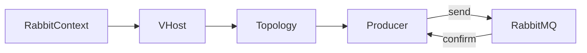

# Helloworld Producer

Minimal producer that declares a queue/exchange, publishes one JSON payload, waits for a confirm, then exits.

## Flow

## What it demonstrates
- Parsing an AMQP URI ([`rmqa::ConnectionString`](../../src/rmq/rmqa/rmqa_connectionstring.h)) and creating a vhost connection.
- Building topology, creating a producer, sending a message, and waiting for confirms on the shared `rmqio::AsioEventLoop` thread.
- Suitable for single-threaded [`io_context`](https://www.boost.org/doc/libs/latest/doc/html/boost_asio.html) usage; all work runs on the same loop that can also host other Asio handlers.

## Build Links
- Target `rmqhelloworld_producer` links [`rmq`](../../src/rmq/rmqa/README.md) and [`bsl`](https://github.com/bloomberg/bde) (no test utilities needed).
