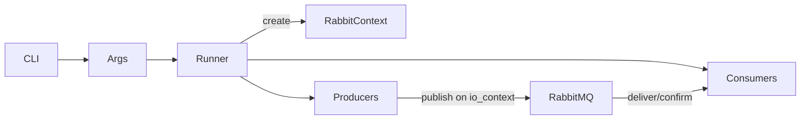

# rmqperftest

Performance harness that produces and consumes messages to benchmark throughput/latency. It is built as `rmqperftest` and can be parameterized via CLI arguments.

## Components
- `rmqperftest_runner.*` — orchestrates producers/consumers based on parsed args.
- `rmqperftest_args.*` / `rmqperftest_consumerargs.*` — parse CLI options (endpoints, rates, payload sizes).
- `rmqperftest.m.cpp` — entry point wiring everything together.

## CLI Arguments (partial)
- Connection: `--endpoint` / `--vhost` / `--username` / `--password` (parsed into `rmqt::Endpoint`/credentials), `--shuffle-endpoints`.
- Topology: `--exchange`, `--routing-key`, `--queue`.
- Producer: `--producer-rate`, `--producers` (count), `--message-size`, `--messages`, `--flag` (`persistent`), `--body-file` (payload file), `--confirm-timeout`, `--mandatory`.
- Consumer: `--consumers` (count), `--consumer-rate`, `--qos` (prefetch), `--consumer-args` (comma-separated key/value e.g. `x-priority=1`).
- TLS: `--cert`, `--key`, `--cacert`, `--verify-mode`.
- Misc: `--log-level`, `--no-topology` (skip declare), `--help`.
See `rmqperftest.m.cpp` and `rmqperftest_args.h` for the full list and defaults.

## Flow

## Build Links
- Target links [`rmq`](../../src/rmq/rmqa/README.md) (core client), [`rmqintegration`](../../src/tests/integration/README.md) (integration helpers for live-broker runs), `bsl`, and `bal`; built with `USES_LIBRMQ_EXPERIMENTAL_FEATURES` to exercise optional features (see [`docs/experimental-features.md`](../../docs/experimental-features.md)).
- Uses the same `rmqio::AsioEventLoop` underneath, so it can be pinned to a single thread for deterministic perf runs or co-hosted with other Asio/`io_uring` workloads. All work runs on a shared [`io_context`](https://www.boost.org/doc/libs/latest/doc/html/boost_asio.html).
