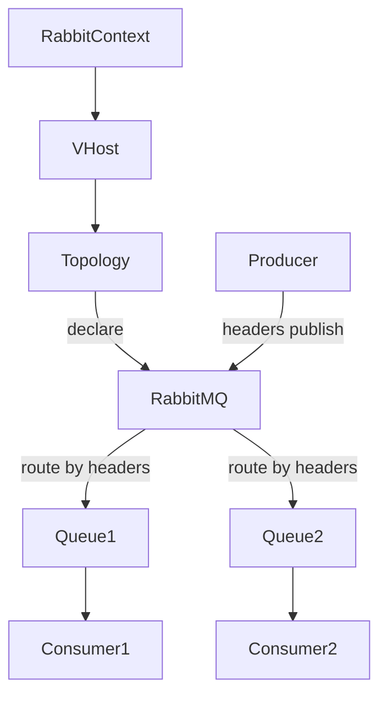

# Headers Exchange Topology

Demonstrates declaring a headers exchange with two queues using different `x-match` header tables, producing a message, and consuming from both queues.

## Flow

## Highlights
- Uses [`rmqt::ExchangeType::HEADERS`](../../src/rmq/rmqt/rmqt_exchangetype.h) and binding arguments to route messages by header fields rather than routing keys.
- Runs producer and consumers on the shared [`rmqio::AsioEventLoop`](../../src/rmq/rmqio/README.md); keeps flow single-threaded while still handling reconnects.
- Shows how confirms and consumer callbacks interleave on the same [`io_context`](https://www.boost.org/doc/libs/latest/doc/html/boost_asio.html), allowing other Asio services (io_uring/epoll timers) to coexist.

## Build Links
- Target `rmqtopology_headers` links [`rmq`](../../src/rmq/rmqa/README.md) and [`bsl`](https://github.com/bloomberg/bde).
