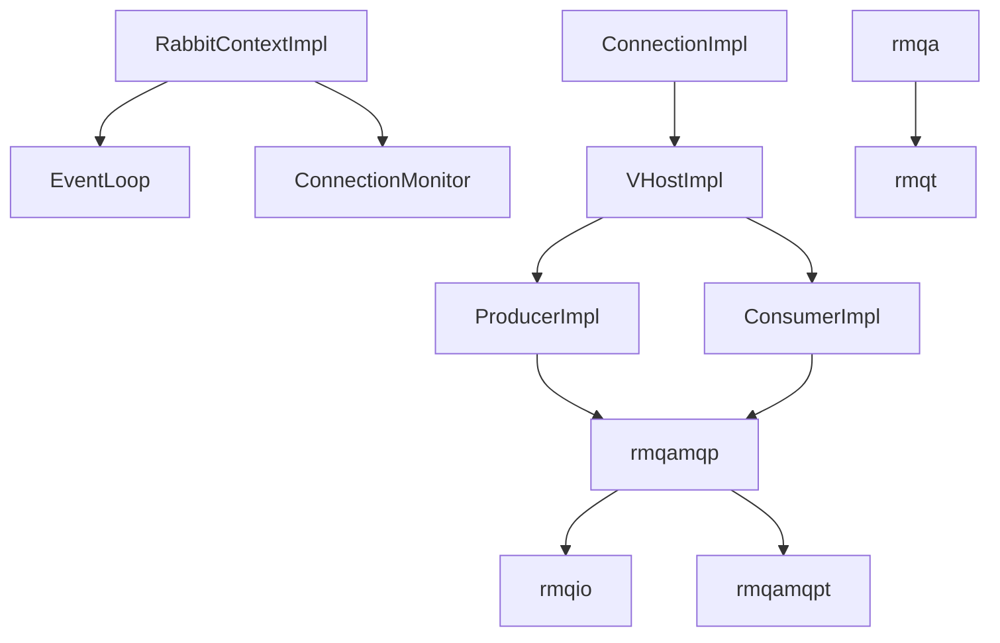

# rmqa (Implementations)

Concrete implementations of the public `rmqp` interfaces. This layer wires the event loop, protocol, retry/watchdog logic, and tracing hooks.

## Key Classes
- Context & lifecycle: `RabbitContextImpl`, `RabbitContextOptions`, `ConnectionMonitor`, `WatchDog` (via `rmqio`) supervise connections and thread pools.
- Connection/VHost: `ConnectionImpl`, `VHostImpl`, `VHost` manage endpoints, credentials, and create channel objects; `ConnectionString` builds AMQP URIs.
- Producers: `Producer`, `ProducerImpl`, `TracingProducerImpl` coordinate confirm handling and backpressure; integrate with `MetricPublisher`.
- Consumers: `Consumer`, `ConsumerImpl`, `TracingConsumerImpl` map deliveries to callbacks, manage prefetch, and automatic redeclare on cancel.
- Topology: `Topology`, `TopologyUpdate` prepare queue/exchange/binding declarations; align with `rmqt` handles.
- Message safety: `MessageGuard`, `TracingMessageGuard`, `CompressionTransformer` & `CompressionTransformerImpl` support compression pipelines.
- Utility glue: `NoopMetricPublisher`, `RabbitContextOptions`, `VHostImpl` options; `ConnectionMonitor` detects disconnects and retries; `RabbitContextOptions` toggles compression, shuffle endpoints, and event loop ownership.

## Dependencies

- `rmqa` implementations call into `rmqamqp` to translate operations into AMQP frames, then through `rmqio::Connection` for wire I/O.
- The injected `rmqio::EventLoop` (default `AsioEventLoop`) drives all async work. Because `AsioEventLoop` exposes its `io_context`, you can share the same loop with other epoll/io_uring/timerfd/inotify sources.
- Retry/backoff: `ConnectionMonitor`, `ConnectionImpl`, and `WatchDog` rely on `rmqio::RetryHandler`/`TimerFactory` to schedule reconnects.

## Entry Points
- Main constructors: `RabbitContextImpl` and `VHostImpl` are the user-visible concrete types returned through the `rmqp` interfaces.
- For single-threaded reactors, supply a custom `rmqio::EventLoop` via `RabbitContextOptions` to re-use your `io_context`.
