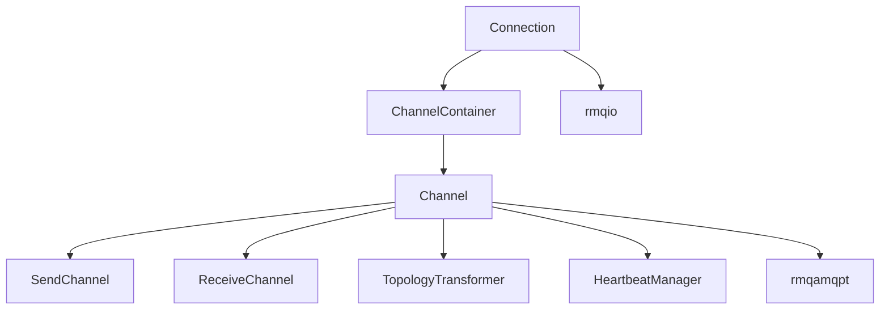

# rmqamqp (AMQP Abstraction)

Implements channel and connection state machines that translate high-level API calls into AMQP 0-9-1 frames and back.

## Key Classes
- `Connection` — owns AMQP handshake, channel allocation, and dispatch of frames to channels.
- `Channel`, `SendChannel`, `ReceiveChannel` — base and specialized channel logic for publishers/consumers; manage topology declaration, flow control, and confirm/ack paths.
- `ChannelContainer`, `ChannelFactory`, `ChannelMap` — create and track channels and their lifecycles.
- `ContentMaker`, `Framer` — frame encoding/decoding helpers; interact with `rmqio::Decoder` and serialized frames.
- `HeartbeatManager`/`HeartbeatManagerImpl` — schedule heartbeat writes and detect stalls.
- `Message`, `MessageWithRoute`, `MessageStore` — wrap frames and routing metadata for multiplexing.
- `Metrics` — emit counters/latency for protocol-level events.
- `MultipleAckHandler` — groups confirms and handles multi-ack behavior.
- `TopologyMerger`, `TopologyTransformer` — reconcile desired topology with broker state and emit AMQP declare/bind/unbind frames.

## Dependencies

- Relies on `rmqamqpt` for concrete AMQP methods/frames and on `rmqio::Connection` for socket I/O.
- Receives topology from `rmqa`/`rmqp`, converts to AMQP methods, and pushes frames through `rmqio`.

## Entry Points
- `rmqa::ConnectionImpl` creates `rmqamqp::Connection` instances that run on the shared `rmqio::EventLoop` (`boost::asio::io_context`). This allows the AMQP state machines to coexist in the same thread with other `io_context` work (io_uring, epoll/kqueue descriptors, timers).
