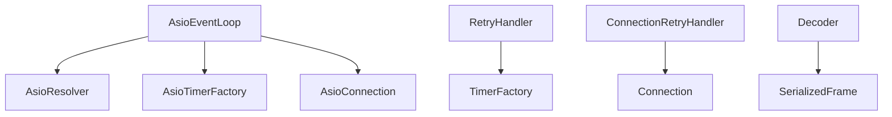

# rmqio (I/O & Event Loop)

Abstractions around event loops, sockets, DNS, timers, retries, and frame serialization. The default implementation uses Boost.Asio and exposes the underlying `io_context` so RabbitMQ traffic can share the same reactor with other workloads.

## Event Loop
- `EventLoop` — abstract single-threaded executor with `post`, `dispatch`, and `postF` helpers; joins on destruction.
- `AsioEventLoop` — default implementation backed by `boost::asio::io_context` with a work guard; exposes `context()` for registering external descriptors (inotify, eventfd, timerfd, TCP/UDP sockets, REST clients) or io_uring-ready executors.
- Integration tips: create your own Asio services against `context()`; run the loop on one thread if you need strict ordering with other epoll/io_uring/kqueue events.

## Networking & Timers
- `Connection` — abstract async read/write/close for serialized AMQP frames.
- `AsioConnection` — templated socket wrapper (plain or TLS) that runs reads/writes on the shared `io_context`.
- `Resolver`/`AsioResolver` — DNS lookups with optional endpoint shuffling.
- `Timer`/`TimerFactory`/`AsioTimerFactory` — scheduling for heartbeats, retries, watchdog checks.
- `Decoder`/`SerializedFrame` — decode/encode frames to/from the wire.

## Reliability
- `RetryStrategy`, `BackoffLevelRetryStrategy`, `RetryHandler`, `ConnectionRetryHandler` — retry/backoff control for reconnects.
- `WatchDog` — periodic health checks that can trigger reconnect or fatal shutdown if heartbeats stall.
- `Task` — small utility to encapsulate work posted to the loop.

## Dependencies

- Sits under `rmqamqp` and above the system networking stack; agnostic to which Asio backend is selected (epoll, kqueue, io_uring).
- Because `io_context` is exposed, external REST/TCP/UDP clients or OS event handles can be colocated with RabbitMQ traffic on a single thread.
