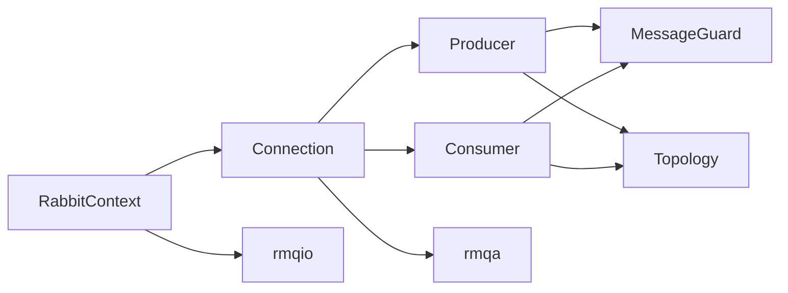

# rmqp (Public API)

Public interfaces for applications. These types are thin handles that forward to the `rmqa` implementations and remain stable for user code.

## Classes
- `rmqp::RabbitContext` — application entry point; owns the event loop (default `rmqio::AsioEventLoop`) and creates virtual host connections.
- `rmqp::Connection` — represents a vhost connection; builds producers/consumers and tracks lifecycle.
- `rmqp::Producer`/`rmqp::ProducerTracing` — publish messages; tracing wrapper emits spans/metrics.
- `rmqp::Consumer`/`rmqp::ConsumerTracing` — consume messages; tracing wrapper decorates callbacks.
- `rmqp::MessageGuard` — RAII wrapper giving access to a delivered `rmqt::Message` with ack/nack helpers.
- `rmqp::MessageTransformer` — hooks to transform outbound messages (compression/encryption/custom metadata).
- `rmqp::MetricPublisher` — extension point for emitting metrics from producers/consumers.
- `rmqp::Topology`/`rmqp::TopologyUpdate` — declarative queue/exchange/binding view passed down to the protocol layer.

## Dependencies and Flow

- Interfaces depend on `rmqt` data types and are implemented by `rmqa::*Impl` classes.
- `RabbitContext` injects an `rmqio::EventLoop` (Asio by default) so applications can share the `io_context` with other epoll/io_uring/kqueue sources.

## Entry Points
- Typical construction path: `rmqa::RabbitContext ctx{rmqa::RabbitContextOptions{...}}; auto vhost = ctx.createVHostConnection(...); auto producer = vhost->createProducer(...); auto consumer = vhost->createConsumer(...);`
- For single-threaded Asio/reactor setups, keep the same `io_context` alive and let `rmqp::RabbitContext` run RabbitMQ work alongside your other descriptors.
