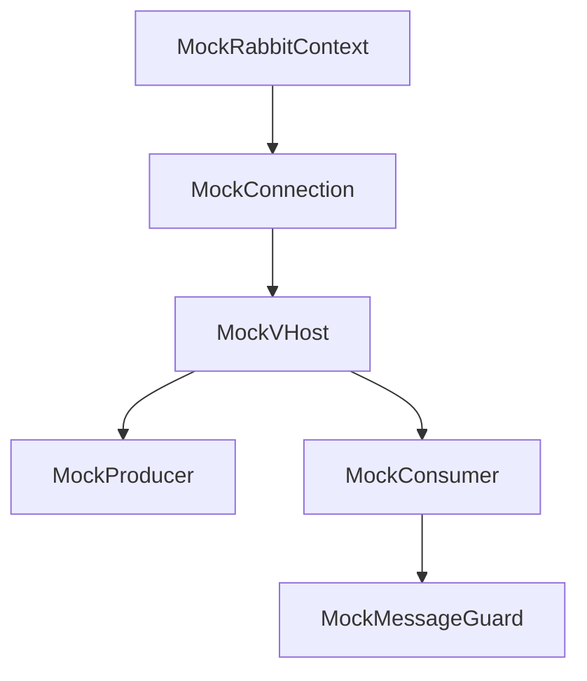

# rmqtestmocks (Mocks)

GoogleMock-based fakes for the `rmqp` surface. Use these to unit test application code without spinning up RabbitMQ.

## Files and Roles
- `rmqtestmocks_mockrabbitcontext.{h,cpp}` — mock `rmqp::RabbitContext` that can hand out mock connections/vhosts.
- `rmqtestmocks_mockconnection.{h,cpp}` — mock `rmqp::Connection` returning prewired producers/consumers.
- `rmqtestmocks_mockvhost.{h,cpp}` — mock `rmqa::VHost`/`rmqp::Connection` derivative for topology-aware tests.
- `rmqtestmocks_mockproducer.{h,cpp}` — mock producer with expectations on `send`/`waitForConfirms`.
- `rmqtestmocks_mockconsumer.{h,cpp}` — mock consumer supporting `cancel`/`cancelAndDrain` flow.
- `rmqtestmocks_mockmessageguard.{h,cpp}` — mock ack/nack guard to verify consumer callback behavior.

## Relationships

- Mocks mirror the creation chain used in production: context → connection/vhost → producer/consumer → message guard.
- Pair these with `rmqtestutil` helpers (mock timers/resolvers) when you need to simulate retries or timeouts.

## Entry Points
- Include the relevant mock header in your test and inject it wherever application code expects an `rmqp` interface. Because the mocks are pure gmock, they can run on any thread/event loop and fit naturally alongside tests that also exercise other Asio `io_context` work.
